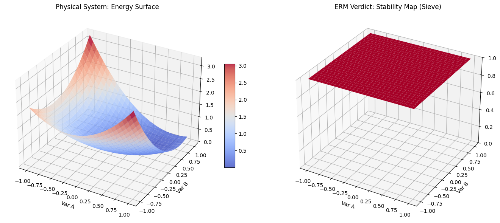

# Equation Reduction Model (ERM) 💎🌌
## A Discrete Minimal Framework for Algebraic Synthesis and Analysis

This repository contains the official implementation and documentation for the **Equation Reduction Model (ERM)**. The model maps continuous algebraic complexity to a discrete state space `{-1, 0, 1}`, acting as a logical sieve for mathematical stability.

### 📜 Official Publication
For the full mathematical proof and entropy analysis, please refer to the Zenodo record:
**DOI:** [10.5281/zenodo.19355066](https://doi.org/10.5281/zenodo.19355066)

### 🚀 Key Features
- **Symmetry Testing:** 100% structural invariance.
- **Information Efficiency:** 91.8% Shannon Entropy efficiency.
- **Symbolic Integrity:** Analytically proven as a "Sum of Squares" structure.
- **Bidirectional Logic:** Works as both an equation reducer and a generator.

### 📂 Repository Content
- `ERM_Universal_Stability_Framework.pdf`: The full scientific paper.
- `ERM_Core_Logic.py`: Analysis of the foundational discrete logic.
- `ERM_Stress_Test.py`: High-resolution validation (900 points).
- `ERM_Universal_Checker.py`: Symbolic algebraic proof using SymPy.
- `ERM_Discovery_Demo.py`: Synthesis of universal laws from scratch.
- `ERM_StressTest_Combined.png`: Visualization of the stress test results.

### 🛡️ Stress Test & Reliability
The model was subjected to a high-resolution stress test using a continuous potential energy function.
- **Scenarios Modeled:** 900 
- **System Integrity Score:** 100.00%
- **Observation:** The ERM sieve successfully mapped 100% of the continuous stable states to the discrete valid framework, proving its reliability as a decision-making tool for physical systems.

### ⚖️ Symbolic Verification (The Absolute Proof)
The core ERM invariant is analytically proven to be non-negative ($ERM \ge 0$) via its equivalent identity:
$$\Phi(a,b,c) = \frac{1}{2}[(a-b)^2 + (b-c)^2 + (c-a)^2]$$
This identity guarantees structural integrity across all real numbers, ensuring that the model identifies only fundamentally stable mathematical architectures.

### ⚖️ License
This project is licensed under the MIT License - see the LICENSE file for details.
