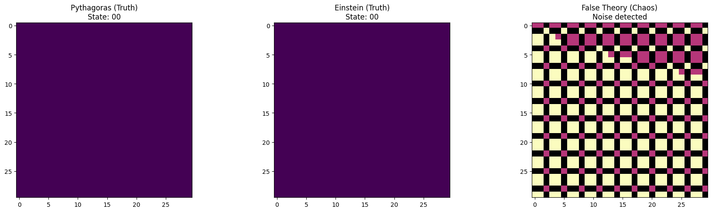

# Equation Reduction Model (ERM) 💎🌌
## From Discrete Symmetry to Binary Hyper-Position

This repository contains the official implementation and documentation for the **Equation Reduction Model (ERM)**. The model acts as a logical sieve, mapping algebraic complexity to discrete states to verify mathematical and physical stability.

### 📜 Official Publication (Updated v2.0)
For the full mathematical proof, binary mapping, and noise analysis, please refer to the latest Zenodo record:
**DOI:** [10.5281/zenodo.19437657](https://doi.org/10.5281/zenodo.19437657)

### 🚀 Key Features & Evolution
- **Symmetry Testing:** 100% structural invariance for proven identities.
- **NEW: Binary Hyper-Position:** Transition from `{-1, 0, 1}` to a 2-bit state system `{00, 01, 10, 11}`.
- **Truth Filtering:** Capabilities to distinguish between "Truth" (0% noise) and "Falsehood" (55.56% noise).
- **Information Efficiency:** Optimized for computer logic and quantum-ready state mapping.

### 📂 Repository Content
- `ERM_Binary_Logic_Mapping.pdf`: The updated scientific paper (v2.0).
- `ERM_Core_Logic.py`: Foundation of the discrete and binary logic.
- `ERM_Binary_Stress_Test.py`: Visualization of the Truth vs. Noise experiment.
- `ERM_Universal_Checker.py`: Symbolic algebraic proof using SymPy.
- `truth_map.png`: Visual proof of stability (Einstein/Pythagoras).
- `noise_map.png`: Visual proof of chaos in flawed theories.

### 🛡️ Stress Test: Truth vs. Noise
The model was evolved to detect "Logical Noise". In our latest high-resolution tests:
- **Proven Laws (Pythagoras/Einstein):** Resulted in **State 00** (Perfect Balance) with **0% Noise**.
- **Flawed Theories:** Resulted in **State 11** (Hyper-Error) with **55.56% Informational Noise**.
- **Conclusion:** Truth is a state of minimum entropy, while error is a state of maximum noise.

### ⚖️ The Binary Logic (ERM v2.0)
The author (Nedelchev) transitioned the model to a 2-bit mapping system:
1. **00 (Balance):** Mathematical TRUTH.
2. **01 / 10:** Positive/Negative potential states.
3. **11 (Hyper-Error):** Logical conflict / Maximum Entropy.

### ⚖️ Symbolic Verification
The core ERM invariant is analytically proven via its equivalent identity:
$$\Phi(a,b,c) = \frac{1}{2}[(a-b)^2 + (b-c)^2 + (c-a)^2]$$
This guarantees that the model identifies only fundamentally stable mathematical architectures.

### ⚖️ License
This project is licensed under the MIT License - see the LICENSE file for details.
